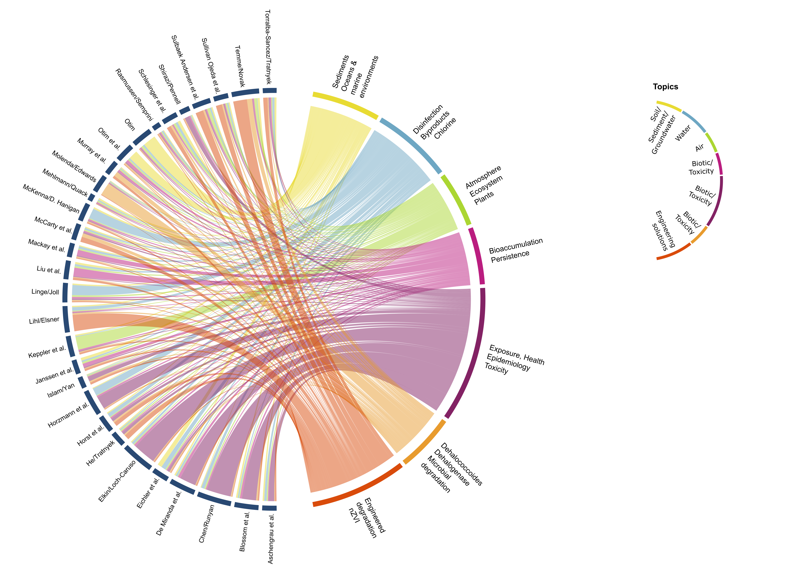

```{r setup, include=FALSE}
knitr::opts_chunk$set(echo = FALSE)
```

These visualisations are the ones I did for the editorial article of the journal Environmental Science: Process and Impact March 2020 Issue. The idea behind this project was to find which was the topic for the article submitted in that issue. To do this I performed a topic analysis using the title and abstract of the submitter paper. To represent the topics of each articles I used a chord diagram, which I realised with the R package `circlize`.



From this analysis I have also realized the front cover for the March 2020 Issue To realise the cover using the chord diagram realised for the editorial article and as background I realised an handmade watercolour of the sea with the sand. What an honour to have my work on the cover!


