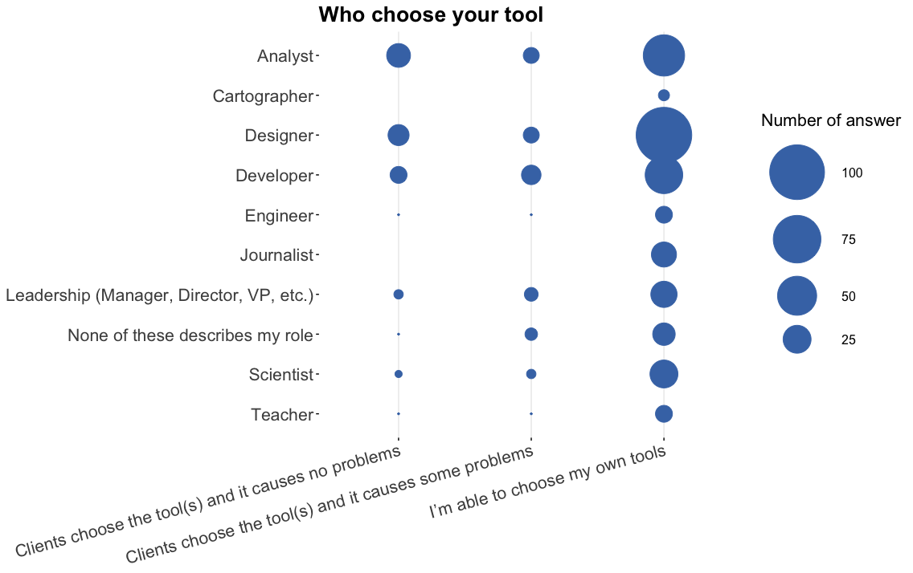
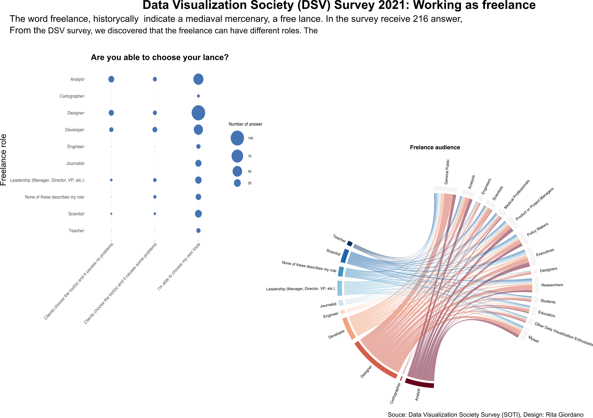

```{r setup, include=FALSE}
knitr::opts_chunk$set(echo = FALSE)
```

The Data Visualization Society (DVS) performed in 2021 a survey focused on the state of the industry, the Annual Data Visualization State of the Industry (SOTI).
The DSV survey received 2165 answers and 464 identified themselves as Freelance, Consultant or Independent contractor. 
However, who identified their role as a freelance in most cases has also another job. 
For example out of this 464 freelance, 160 covered also positions in an organisation with some data visualization job responsibilities.
Only 228 out of 464 participants of the survey described their role only as Freelance, Consultant or Contractor.

## Freelance freedom to choose their tool.

The word freelance historically indicates a medieval mercenary, originally as two words `free lance`.
The DSV survey asked the freelances if the are free to choose their tool. Journalists and cartographers are completely free to choose their tool. The 82% of Designers and only the 68% of Analysts are free to choose their tool. Overall, the majority of the participants are free to choose their tool. 

```{r layout="l-body-outset"}

```

## Freelance audience.

Another question was: "As a freelancer, who do you make data visualizations for? Select all that apply." The majority of the freelancers identified as Designer, 30%, and their audience can be from general public to analysts, from scientists to researchers. Designers, are the biggest proportion of freelancers and they also reach out almost all the audience indicate in the survey. Analysts, 20%, and Developers, 16%, are the other roles that reach out the majority of the audience specified in the survey.

```{r layout="l-body-outset"}
knitr::include_graphics("img/chord_survey.png")
```

```{r layout="l-body-outset"}
#
```


