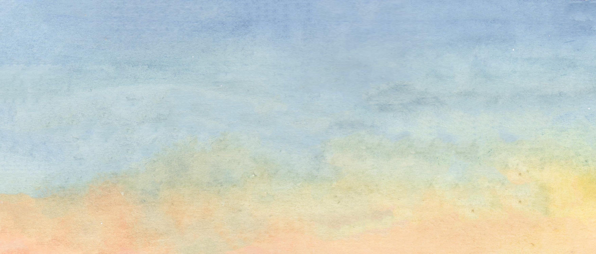

<style>
    
.parallax {
  /* The image used */
  background-image: url('img/sfondo.jpg');

  /* Full height */
  height:100%;

  /* Create the parallax scrolling effect */
  background-attachment: fixed;
  background-position: center;
  background-repeat: no-repeat;
  background-size: cover;
}

.welcome {
  position: absolute;
  left: 0;
  top: 25vh;
  width: 100vw;
  text-align: center;
  color: #000;
}

.welcome span.title {
  font-family: 'Open Sans', sans-serif;
  color: #000;
  font-size: 24px;
  letter-spacing: 10px;
  line-height: 1.6;
}

.welcome span.surrounding {
  font-family: 'Open Sans', sans-serif;
  color: #000;
  font-size: 48px;
  letter-spacing: 5px;
}

.welcome span.downarrow {
  font-size: 42px;
}


.downbutton {
  background: rgba(0,0,0,0);
  border: none;
  outline: none;
  color: #1BC7DC;
  text-align: center;
  font-size: 42px;
}

d-title.d-title {
  display: none;
}

d-article {
  margin-top: 0px;
  margin-bottom: 0px;
  margin-left: 30px;
  margin-right: 30px;
  grid-column-gap: 32px;
}

.greeting {
  min-height: 50vh;
  padding-top: 25vh;
  font-size: 20px;
  text-align: center;
  line-height: 1.25;
}
</style>


<div class="parallax l-screen">
<div class="welcome">
  <span class="surrounding">Rita Giordano<br><br>
  Data visualisation and scientific illustration</span><br><br>
   <span class="title">Do you have data to visualise?<br> I will find the best way to visualise them.<br><br>
   Do you need a graphical abstract or a scientific illustration?<br> I will create the illustration that best fit your needs.
   </span>
</div>
</div>


```{r setup, include=FALSE}
knitr::opts_chunk$set(echo=F, message=F, warning=F)
library(tidyverse)
```

```{r layout="l-screen"}

```

<!-- Hello I'm Rita a data visualisation consultant and scientific illustrator. I have more than thirteen years of experience in data analysis and visualisation. -->

```{r}
# Read in projects csv file
first <- read_csv("data/first_page.csv")
```

```{r projects, echo=FALSE, layout="l-body-outset"}
 first[1:2,] %>%
   bs4cards::cards(
     title = title,
     #text = description,
     link = url,
     image = src,
     layout = "label-above",
     spacing = 5,
     #width = 1,
     width = "row-cols-2",
     border_width = 0,
     #layout = "inset-bottom",
     label_colour = c("#ffffffaa", "#ffffffaa"),
     breakpoint = 5,
     #border_colour = "#ffffffaa"
  )
```

