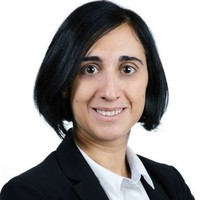

```{r setup, include=FALSE}
knitr::opts_chunk$set(echo = FALSE)

# Learn more about creating websites with Distill at:
# https://rstudio.github.io/distill/website.html

# Learn more about publishing to GitHub Pages at:
# https://rstudio.github.io/distill/publish_website.html#github-pages

```

```{r, echo=FALSE, fig.align='center'}

```


I am a physicist turned data scientist and I am currently based in UK.
Life bring me traveling across Europe.
From the highest volcano in Europe, where I graduated in Physics I landed to the French alps to do a PhD at the European Synchrotron Radiation Facility (ESRF) in statistics and physics applied to structural biology. After my PhD, from alps to alps I did my first postdoc at the Swiss Light Source.
Later on I moved to the capital of Europe to discover beautiful vineyard  and to start to work as biostatistician. Never tired to travel and discover new places, I decided to come back to research and I started a second post doc in one of the oldest university in Europe so I went to Cambridge. From there continue my european tour and after a parental leave I began my data scientist adventure in Karlsruhe.
Later than I came back to Strasbourg to start a new life as data scientist freelance. Lastly I moved again to Cambridge and now I work as data scientist for the Royal Society of Chemistry.

I like to create visualisation and learning new stuffs day by day. If you are here you can look at the section Portfolio to see some examples of what I do and I like to do.
