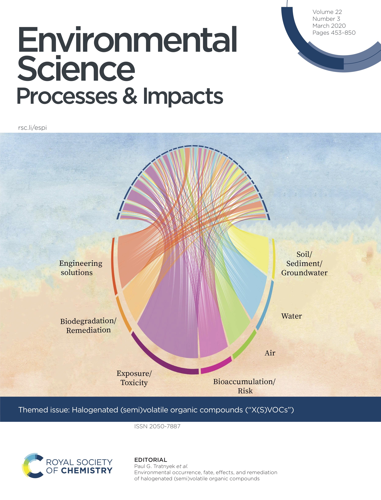

<!-- Remove margin under images -->
<style>
d-article div.sourceCode pre {
  background: #dae7f1;
}

code {
  background-color: #dae7f1;
}

d-article pre  {
  background-color: #dae7f1;
}
</style>

```{r setup, include=FALSE}
knitr::opts_chunk$set(echo = FALSE)
library(tidyverse)

# Learn more about creating websites with Distill at:
# https://rstudio.github.io/distill/website.html

# Learn more about publishing to GitHub Pages at:
# https://rstudio.github.io/distill/publish_website.html#github-pages

```
I am a physicist turned data visualisation designer and scientific illustrator. I am currently based in UK. Life brought me travelling all across Europe. From the highest volcano in Europe, where I graduated in Physics, to the French Alps for a PhD at the European Synchrotron Radiation Facility (ESRF) in statistics and physics applied to structural biology. After my PhD, from Alps to Alps, I did my first postdoc at the Swiss Light Source (SLS). Later on, I moved to the capital of Europe to work as biostatistician. Never tired to travel and discover new places, I decided to come back to academic research.  In 2014 I started a second post-doc in one of the oldest university in Europe, Cambridge. After this great experience, I continued my European tour. After a parental leave I began my data scientist adventure in Karlsruhe. Afterwards I came back to Strasbourg to start a new life as data scientist freelance. I moved again to Cambridge, working as data scientist and data visualisation designer. Now I seek a new challenge in data visualisation and scientific illustration.
```{r}
# Read in projects csv file 
first <- read_csv("data/first_page.csv")
```

```{r projects, echo=FALSE, layout="l-body-outset"}
first %>% 
  bs4cards::cards(
    title = title,
    #text = description,
    link = url,
    image = src,
    layout = "label-above",
    spacing = 5,
    #width = 1,
    width = "row-cols-2",
    border_width = 0,
    #layout = "inset-bottom",
    label_colour = c("#ffffffaa", "#ffffffaa"),
    breakpoint = 5,
    #border_colour = "#ffffffaa"
    
  )
```


```{r layout="l-body-outset"}
# knitr::include_graphics("img/cover.png")
```

<!--  -->
